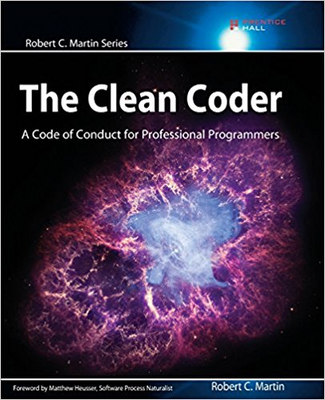

## Crafting Agile Estimates
Klee Thomas

@kleeut
Speaker:
Intro self

What I'd like to talk about today is estimation. It's something that we all do and something that most if not all of us find increadibly taxing. 

---

## What is an estimate?

Speaker:
Time?
$$$?
Guess?
Fiction?

---

Complexity

Time 

Money

---

Guess

Fiction

---

## A commitment

---

## Estimates are a tool
Speaker: 
Like all tools they have their used but they can be misused and abused. 

To often we use estimates for all the wrong reasons. 
We do them because we always have. 
Because we're caught up in big A agile and it says we have to.
Because a manager said we need to. 

Then these estimates are then taken as a commitment. 

Estimate accuracy is used as a KPI.  We know that measures used as target it ceases to be a good measure. So estimates are padded.  And now we see estimates as fiction and obviously the answer is simple.

---

# #NoEstimates
Speaker:
Thow out the estimates. Right? 

 #Noestimates has been popping up in my Tiwtter feed once again. 
 No estimates sounds really good when you hear someone like Woody Zuill talk about it.  He speaks of a pure and unadulterated agile.  Delivering only the most important and useful features quickly and with low over head.  Sounds brilliant, and if you can make it work, good on you.  Unfortunately I think it's a unicorn, aka not achievable by any given team. 

 Even if it was what I hear from every day developers is very different to what Woody Zuill has to say no estimates. It's less pure agile and much more of Estimates are hard so lets give up on them.

 We as developers want to give up on them, giving up on estimates is a great way to facilitate our code addiction and put us back into chasing that builders high. 
 You know the one, the feeling you get when you've written a nice peice of code, or when you get to see that feature you've been working on 

 Giving up just because something is hard or we'd rather be doing something else has never really been good enough.  

* Woody Zuiel vs the Evangalist
* Unrealistic 
* If you dont estimate someone else will. 
* You might as well get involved. 

---

If you don't estimate your work,

Someone else will.

Speaker:
The case for not giving up is that if you dont estimate your work someone else will and this increases the chance that you'll be left of the conversations around your work. 

---

## Communication

Speaker:

Why should you not give up on estimates. 
Estimates are a about communication.  
They're about building a shared understanding between the people that need the work done, the business stake holders, and the people that are giong to do the work, the Development team. 

Estimation as part of the communication startegy around pre project planning and project inception can help you to prevent the idea that it is "Just a website, my neighbours kid makes websites" and that idea that the business can order apps like pizza.  I'll have one web app with a sprinkle of PWA please.

Estimation is a key chance for us to communicate the complexity and intricasy of a solution to the business.

---

## Why are you estimating?

Speaker:

The first step to being lean and agile with anything is not doing what you dont need to do.  

This is true of estimating as it is with anything else. 

---

Before asking for or providing an estimate.

First ask yourself what decisions the estimate will be informing.

Speaker:

I know this seems obvious, but understanding what someones intentions with your estimate are can be the difference between spending minutes providing TShirt sized estimats so someone knows to schedule a project for 2 or 6 months vs hours putting together detailed estimate to ensure that the company makes a profit on the upcomming project, vs skipping estimates all together because the highest value you can provide is to just push out value. 

---

## What does an estimate actually look like?

Speaker: 
If you know why you're giving an estimate. What does your estimate look like.  A single number? 

---

The estimate is:
## 27
That will take **exactly** 27 fairy farts. 

Speaker: 
If we're not happy saying that our estimates are a commitment. Then why do we estimate with solid numbers.  Why do we give an exact number when we think that it will take around 27, maybe more, maybe less and almost certainly not 27. 

Enter Trivariate Estimation. 

---

## Trivariate Estimation

Speaker: 
Now we're getting to the core of this talk. Trivariate estimation, is a technique I picked up reading the clean coder by Uncle Bob. 

---
### Asside: 
You should read The Clean Coder and Clean Code.

Speaker: 
If you haven't read this book it's worth a read.

---

## Trivariate Estimation

Speaker: 

Trivariate estimation, as the name implies uses three estimates as the inputs to help you produce a better estimate. I can hear what you're all thinking, why would I want to do the thing that you've established that I'm bad at three times.  And we're bad at it. how is it going to help? 

I'll start by going through what it is and after that it will be pretty clear to see how this will help you estimate better and how you can use it to work against that commitment idea that we're sure estimates are not. 

---

## 3 estimates
Normal Case 

Best Case

Worst Case

Speaker: 

The three estimates that we'll need can all be given in one sitting.  The idea is not that you estimate the same work on three different days, or that you need to change anything about your environment.  You just need to change your mindset and give an estimate for the normal case, the best case and the worst case. 

---

## Normal Case

Speaker: In this case you simply need to give the estimate you would normally give the work. How long do you honestly think this would take, take into account all the usual things, what have you dont that is like it, how complex does it look, etc, dont pad it, just be honest.  You can estimate in what ever units you want, hours, story points, fuzzy unicorns, it doesnt matter. 

Write it down some where you'll need it later. 

---

## Best Case

Speaker: 
The next extimate is the best case. 
For this estimate you want to think about how this would go on the best day.  You're at your peak, your day is going great, you've had just the right amount of coffee or booze, if you're chasing the ballmer peak. The task you're working on is specced out correctly.  The api you're calling is going to give you just what you want.  That kind of day. 

Write this one down as well as your best estimate.  

---

## Worst Case

Speaker: 
If you've got a normal and a best, then obviously the third estimate is going to be the worst. For this estimate I want you to think about everything that can go wrong. Fighting with your partner, kids are being the worst, or maybe they're sick so you just cant get your head into the game.  
The work well it's all specced wrong, you're gong to have to negotate changes to the api you're calling and you're pretty sure that no one has checked with legal about weather you're allowed to put that data on display to the public. You know it's all going to lead to the whole thing being redesigned and you'll have to do the work at least one more time. But for some reason you're being told just to go ahead and do it. 

I know it's a bit extreme I know but your goal is to look at all the things that could go wrong. 
Write this down as the worst estiamte, if it looks too high, then you're on the right track. 

---

## Math Magic 

Speaker: 
Three estimates are a bit confusing to pass off as a final number, so we'll apply some quick math to it.  

---

Estimate = (B + 4N + 4)/6

Speaker:
The function is quite simple
1 bad 5 normal and 1 worst all over 6. 

This will give you a padded normal case estiamte, and mean that you've gone through a bunch of work just to get from estimates to fancy padded estimates. 

---

## Distribution 
Distribution = (B + W)/6 

Speaker:
Since we have data to work with now we can augment our estimate with a second number. This number represents how distribute the estimates are. 

---

 Estimate |Value
------|--------------
Best| 1
Normal|3
Worst| 12

Speaker:
Say we have these values for a peice of work

---

Output|Value
-----|----
Estimate|4.17
Distribution|2.17

Speaker: 
Then we get these outputs. 

According to Uncle Bob the chances of the task finishing within the estimate +/- the distribusion is around 95%. That's great, now we have an estiamte that is accurate. Better than that though is we can now start to communicate estimates with a confidence value. This means that people trying to optimise the process can now tackle the risk areas rather than the areas with high estimates. 

---
# 90%

Speaker: 
Now we're starting to get there. With trivariate estimation we're communicating estimates to the business that clearly show that they are not commitments, unless they are stable enough to be taken that way.  We're showing that it's not always the big items that are the ones to worry about. Instead they can focus on the items that might come through and take the project out from left field. 

The last part of successfully using trivariate estimation to make your estimates more agile not just more accurate is to document the why of each estimate. 

---

## What are you considering normal?
## What does best look like?
## What does worst look like?

---

## Understand (and document) the why.

Speaker: 
Tracking the why your estimates are what they are is critical to making sure that your estimates are agile. There are two main reasons behind this. 

If you dont know why they were set where they were then how can you adjust them should circumstances change? If the estimate on a story presumes that a certain case is in effect, reusing the example from earlier lets say that you assumed when estimating a story the sprint before the one your about to plan that the legal department would take issue with the design and/or copy. But when you look at it now you can see that legal has signed off both of those thing you'd be right to re-estimate it. 

The second thing that understanding the why will give you is better communication back to the business. Using this method you can show the business that they can have a tangable effect 

---
## Hold on a dang minute?
You're selling me waterfall.

Speaker: 
Get all your estimates done, get them accurate so we can count on them as a commitment. It really is starting to sound like waterfall isnt it. If you play your cards wrong it doesnt matter what you techniques you're using your going to go away from agile. 

---
**Individuals and interactions** over processes and tools

**Working software** over comprehensive documentation

**Customer collaboration** over contract negotiation

**Responding to change over** following a plan

Speaker: 
When you're looking at a tool weather it's Trivariate estimates, no estimates, kanban scrum or the new hotness in Javascript farmeworks if you truely value agile you need to bring it back to the Agile Manifesto and the 12 principles of agile

---

Before asking for or providing an estimate.

First ask yourself what decisions the estimate will be informing.